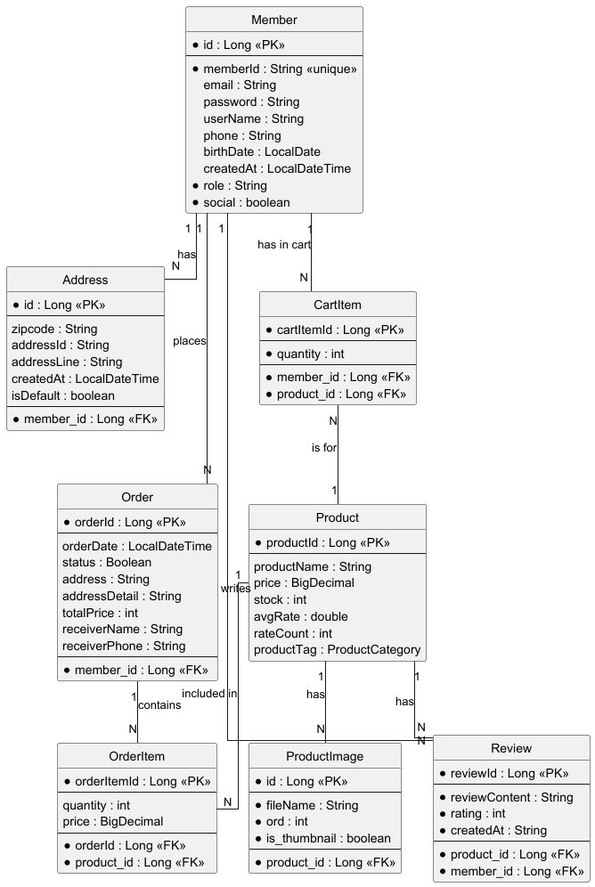
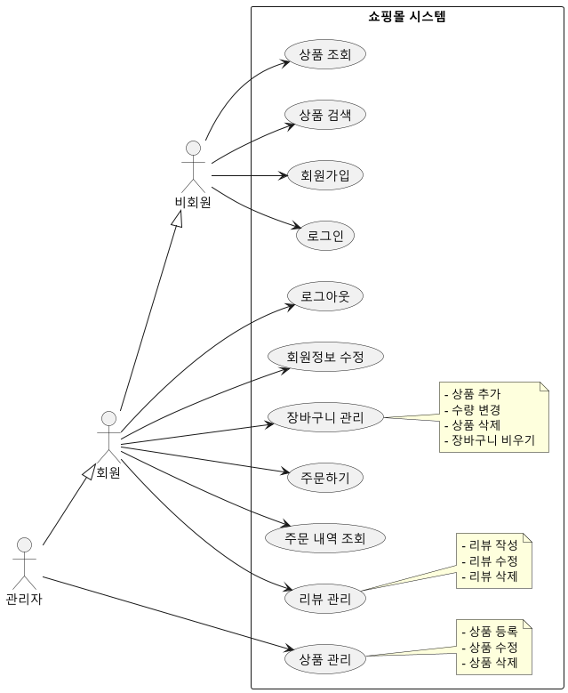
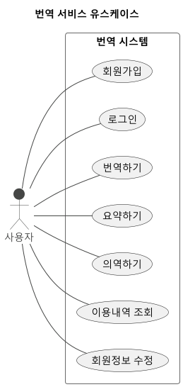
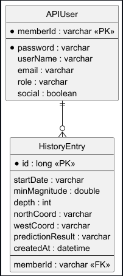
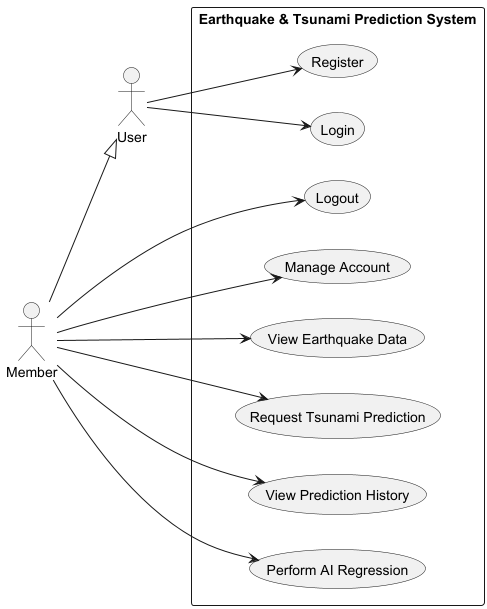

# 👤 인적 사항
| 연락처/정보 | 내용 |
| :--- | :--- |
| 연락처 | 010-3445-6223 |
| 이메일 | jcw6223@naver.com |
| 주소 | 부산시 사상구 냉정로 |

---

# 🛠️ 기술 스택 (SKILL STACK)
## ⚙️백엔드 (Backend)
| 분류 | 기술 스택            | 상세 설명 |
|:-------|:-----------------|----------------------------------|  
| 언어 | Java (Core, OOP) | 객체 지향 원리를 적용한 프로그래밍 및 설계 |
| 프레임워크 | Spring Boot | IoC/DI 핵심 원리 적용 웹 애플리케이션 구축 |
| 보안 | Security & JWT | Stateless 인증 체계 및 토큰 기반 권한 제어 구현 |
| DB 연동 | JPA, QueryDSL | 영속성 컨텍스트 활용 및 동적 쿼리 최적화 |

# 🎨프론트엔드 & 앱 (Frontend & App)
| 분류 | 기술 스택 | 상세 설명 |
|:-------|:-------------|----------------------------------|  
| 프레임워크 | Flutter | 크로스 플랫폼 앱 아키텍처 이해 및 API 연동 |
| 통신 | Axios, RestTemplate | JSON 데이터를 활용한 백엔드-프론트엔드 비동기 통신 |
| 웹 기초 | HTML5, CSS3, JS | 시맨틱 마크업 및 기본적인 웹 UI 구조 이해 |

## 📊 데이터 사이언스 & AI
| 분류 | 기술 스택 | 상세 설명 |
|:------|:---------------|----------------------------------|  
| 언어/서빙 | Python, Flask | 데이터 분석 결과 및 AI 모델 API 서빙 연동 |
| AI 모델링 | Scikit-learn | 머신러닝 알고리즘(회귀, 분류) 모델 구현 및 연동 |
| 딥러닝 | Pandas, Numpy | 데이터 전처리 및 탐색적 데이터 분석(EDA) 수행 |

## 🚀 협업 및 도구 (Collaboration & Tools)
| 분류     | 기술 스택 | 상세 설명 |
|:-------|:---------------|----------------------------------|  
| 버전 관리 | Git, GitHub | 브랜치 전략 기반 협업 및 형상 관리 |
| 빌드 도구 | Gradle | 프로젝트 빌드 및 라이브러리 의존성 관리 |
| IDE | IntelliJ, VS Code | 효율적인 코드 작성 및 디버깅 환경 활용 |

---

# 📚 PROJECT EXPERIENCE

## 1. WebShopping Project
* 기간 : 2025.07.18 ~ 2025.08.04 (5명)
* Repository : https://github.com/chanwoo97/ShoppingWeb_Project.git
* 개요: Spring Boot 기반의 웹 쇼핑몰로, 회원 관리부터 상품 검색, 주문, 리뷰에 이르는 전자상거래 핵심 기능 구현. Controller-Service-Repository의 계층형 아키텍처 적용.
* 개발 환경: SpringBoot, Spring Data JPA, Spring Security, MariaDB, TomCat, HTML, CSS, JS, Git/Github, IntelliJ IDEA.

## 시스템 구조 및 화면
### ERD (Entity Relationship Diagram)

### USECASE Diagram

### 홈페이지 및 상품목록 화면

### 상품 관리(상품 등록/수정/삭제) 화면

## 주요 구현 기능 설명
### 1.상품 CRUD 및 JPA 최적화
* 단순한 기능 구현을 넘어, JPA의 메커니즘을 활용한 성능 최적화와 사용자 경험 향상에 집중했습니다.
* 별도의 save() 호출 없이 트랜잭션 범위 내에서 엔티티 상태 변경만으로 DB 반영을 자동화했습니다.
* 동작 방식 : Transaction 시작 → 엔티티 조회 → 필드 수정 → Commit 시 스냅샷 비교 후 SQL 자동 실행
* 장점 : 불필요한 코드 감소 및 영속성 컨텍스트를 활용한 DB 쓰기 지연(Write-behind) 최적화

### 2. UUID 기반 파일 보안 저장
* 파일명 중복 방지와 경로 추측 공격(IDOR)을 차단하기 위한 보안 로직을 구축했습니다.

|단계|항목|데이터 예시|
|:---|:---|:------|
|Step1|원본 파일명(Input)|product_intro.jpg|
|Step2|UUID 생성(Process)|550e8400-e29b-41d4-a716...|
|Step3|최종 저장명 (Storage)|550e8400_product_intro.jpg|
|Step4|DB 매핑 (Database)|UUID와 OriginalName을 각각 별도 컬럼으로 저장|
* Security Insight: 실제 저장 경로에 랜덤한 UUID를 부여함으로써 외부 사용자가 다른 사용자의 파일 경로를 추측하여 접근하는 것을 원천 차단했습니다.

---

## 2. T.S.P Project(번역 서비스)
* 기간 : 2025.08.21 ~ 2025.08.29 (5명)
* 백엔드 : https://github.com/chanwoo97/TranslationProject-Backend.git
* 프론트엔드 : https://github.com/chanwoo97/TranslationProject-Front.git
* 핵심 기술력 : Google 번역 API 연동 및 Spring Security/JWT 활용 등 서비스 통합과 인증 시스템 구축 능력을 잘 보여줌.

## 📐시스템 구조 및 다이어그램
### ERD(Entity Relationship Diagram)

### USECASE Diagram

## 🖥️주요 화면 및 컴포넌트
### 메인 번역 화면

### 마이페이지

### 네비게이션 바(로그인/로그아웃 상태)

### 상세 번역 결과

* 프론트엔드 (React): 기술 스택: React, react-router-dom, react-icons. 주요 기능: 반응형 디자인, Flexbox 기반 레이아웃, 시맨틱 마크업, 동적 UI 확장성.
* 인증 시스템 연동 (MyPage & UserNav): AuthContext를 활용한 UserNav 및 MyPage 컴포넌트 구현. useAuth 훅을 사용해 로그인된 사용자의 정보를 안전하게 가져와 표시하고, apiClient를 사용해 백엔드 API와 안전하게 통신.

---

## 3. AI기반 실시간 쓰나미 예측 및 시뮬레이터 (기능 구현 강조)
* 기간 : 2025.10.20 ~ 2025.11.13
* 백엔드 : https://github.com/chanwoo97/team_project_back.git
* 프론트 : https://github.com/chanwoo97/team_project_front.git
* AI모델링 : https://github.com/chanwoo97/team_project_python.git

## 📐시스템 구조 및 다이어그램
### ERD(Entity Relationship Diagram)

### USECASE Diagram

## 🖥️주요 화면 및 컴포넌트
### 1. 안전한 사용자 인증 시스템 (Spring Security / JWT)
* 구현 상세: Spring Boot와 Spring Security 기반의 RESTful API에 대한 안전한 인증 시스템 구축. 상태 비저장(Stateless) 세션 관리 모델을 채택하여 확장성을 확보했으며, **JSON Web Token (JWT)**을 사용하여 사용자의 인증 상태를 안전하게 관리합니다.

### 로그인 화면

### 회원가입 화면

### 회원정보 DB

### 2. 지도 기반 시뮬레이터 구현 (Google Maps API / React)
* 구현 상세: 백엔드 API를 통해 Google Maps API 키를 안전하게 가져와 지도를 동적으로 초기화합니다. 지도 클릭 시 마커를 표시하고, 해당 위치의 지표를 쿼리 패널에 반영하여 사용자 요청에 따른 데이터 시각화를 제공했습니다.

### 시뮬레이터 메인 화면

### 3. AI 모델 통합 및 데이터 관리 (Multi-Layer Communication)
* 구현 상세: **React (UI) → Spring Boot (중개/데이터 처리) → Flask (AI 연산) → MariaDB (저장)**의 다층 통신 아키텍처를 구현했습니다. Flask에서 AI 모델 추론이 완료되면 결과는 Spring Boot를 거쳐 MariaDB에 저장된 후, 최종적으로 React에 응답하여 화면을 업데이트하는 구조입니다.

### 예측 쿼리 패널 및 결과

### 지진 발생 경보 모달

### 지진조회 히스토리 화면

### API 서버의 예측 처리 과정 로그
